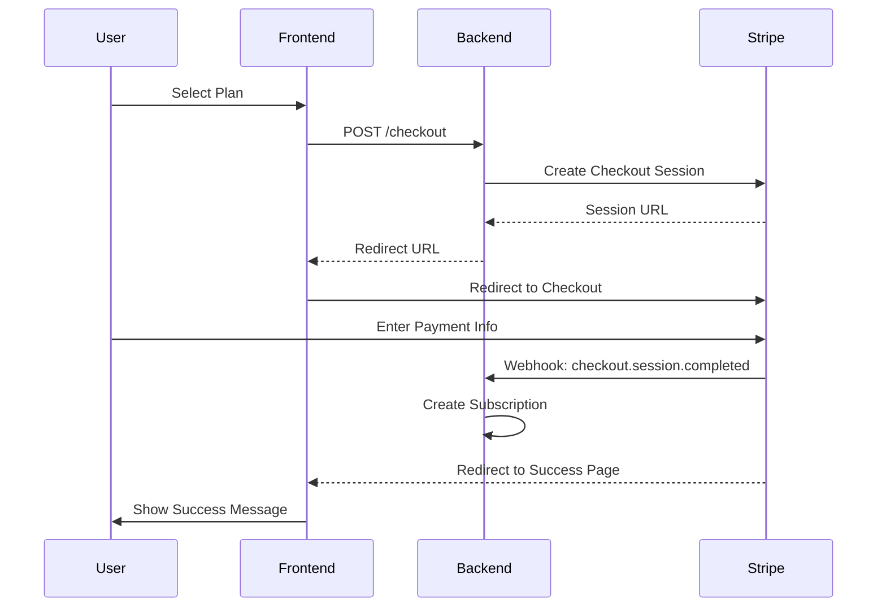

# OCF System Architecture: Roles, Payments & Bulk Licenses

## 📋 Complete System Overview

This document describes the complete architecture of the Open Course Factory (OCF) role-based access control, payment/subscription system, and bulk license management.

---

## 🏗️ System Architecture

```
┌─────────────────────────────────────────────────────────────────────┐
│                          OCF Platform                                │
├─────────────────────────────────────────────────────────────────────┤
│                                                                       │
│  ┌────────────┐  ┌────────────┐  ┌────────────┐  ┌────────────┐   │
│  │   Users    │  │   Roles    │  │Permissions │  │  Groups    │   │
│  │            │◄─┤            │◄─┤            │  │            │   │
│  │ - admin    │  │ - admin    │  │ - create   │  │ - classes  │   │
│  │ - teacher  │  │ - teacher  │  │ - read     │  │ - teams    │   │
│  │ - student  │  │ - student  │  │ - update   │  │ - orgs     │   │
│  └────────────┘  └────────────┘  └────────────┘  └────────────┘   │
│         │              │                │               │            │
│         └──────────────┴────────────────┴───────────────┘            │
│                             │                                        │
│                             ▼                                        │
│  ┌───────────────────────────────────────────────────────────────┐  │
│  │              Subscription & Payment Layer                     │  │
│  ├───────────────────────────────────────────────────────────────┤  │
│  │                                                               │  │
│  │  ┌──────────────┐   ┌──────────────┐   ┌──────────────┐    │  │
│  │  │Subscription  │   │   Stripe     │   │   Billing    │    │  │
│  │  │   Plans      │◄─►│ Integration  │◄─►│   System     │    │  │
│  │  │              │   │              │   │              │    │  │
│  │  │ - Solo       │   │ - Checkout   │   │ - Invoices   │    │  │
│  │  │ - Trainer    │   │ - Webhooks   │   │ - Payments   │    │  │
│  │  │ - Enterprise │   │ - Portal     │   │ - Prorations │    │  │
│  │  └──────────────┘   └──────────────┘   └──────────────┘    │  │
│  │         │                   │                   │            │  │
│  │         └───────────────────┴───────────────────┘            │  │
│  │                             │                                │  │
│  │                             ▼                                │  │
│  │  ┌────────────────────────────────────────────────────────┐  │  │
│  │  │         Bulk License Management (NEW)                  │  │  │
│  │  ├────────────────────────────────────────────────────────┤  │  │
│  │  │                                                        │  │  │
│  │  │  ┌──────────────┐   ┌──────────────┐   ┌──────────┐  │  │  │
│  │  │  │Subscription  │   │   License    │   │ License  │  │  │  │
│  │  │  │  Batches     │◄─►│ Assignment   │◄─►│ Tracking │  │  │  │
│  │  │  │              │   │              │   │          │  │  │  │
│  │  │  │ - Purchase   │   │ - Assign     │   │ - Active │  │  │  │
│  │  │  │ - Manage     │   │ - Revoke     │   │ - Avail  │  │  │  │
│  │  │  │ - Scale      │   │ - Reassign   │   │ - Stats  │  │  │  │
│  │  │  └──────────────┘   └──────────────┘   └──────────┘  │  │  │
│  │  │                                                        │  │  │
│  │  └────────────────────────────────────────────────────────┘  │  │
│  └───────────────────────────────────────────────────────────────┘  │
│                                                                       │
└─────────────────────────────────────────────────────────────────────┘
```

---

## 👥 Role-Based Access Control (RBAC)

### User Roles

The system supports multiple user roles with hierarchical permissions:

| Role | Description | Key Capabilities | Access Level |
|------|-------------|------------------|--------------|
| **Administrator** | System admins | Full system access, manage all users, plans, and settings | Full |
| **Teacher** | Course instructors | Create courses, manage groups, purchase bulk licenses | High |
| **Student** | Course learners | View courses, use terminals, access assigned content | Standard |
| **Guest** | Unauthenticated users | View public content only | Minimal |

### Role Permissions Matrix

```typescript
interface RolePermissions {
  administrator: {
    // User Management
    manageUsers: true,
    viewAllUsers: true,
    deleteUsers: true,

    // Subscription Management
    manageSubscriptionPlans: true,
    viewAllSubscriptions: true,
    syncStripe: true,

    // Bulk License Management
    viewAllBatches: true,
    manageLicenses: true,

    // System Configuration
    manageFeatureFlags: true,
    viewMetrics: true,
    configureSystem: true
  },

  teacher: {
    // Course Management
    createCourses: true,
    manageCourses: true,
    deleteOwnCourses: true,

    // Group Management
    createGroups: true,
    manageGroups: true,
    inviteStudents: true,

    // Bulk License Management
    purchaseBulkLicenses: true,
    assignLicenses: true,
    revokeLicenses: true,
    viewOwnBatches: true,

    // Terminal Management
    createTerminals: true,
    shareTerminals: true
  },

  student: {
    // Course Access
    viewCourses: true,
    accessAssignedCourses: true,

    // Terminal Access
    useTerminals: true,
    viewSharedTerminals: true,

    // Group Access
    viewOwnGroups: true,

    // Subscription
    viewOwnSubscription: true,
    upgradeSubscription: true
  }
}
```

### Role-Based Navigation

Navigation menu adapts based on user role:

```typescript
// Main menu categories filtered by role
const menuCategories = [
  {
    key: 'courses',
    label: 'Course Design',
    allowedRoles: ['administrator', 'teacher', 'student']
  },
  {
    key: 'labs',
    label: 'Practical Work',
    allowedRoles: ['administrator', 'teacher', 'student']
  },
  {
    key: 'subscription',
    label: 'Subscription & Licenses',
    allowedRoles: ['administrator', 'teacher', 'student']
  },
  {
    key: 'admin',
    label: 'Administration',
    allowedRoles: ['administrator']  // Admin only
  }
]
```

---

## 💳 Payment & Subscription System

### Subscription Plans

#### Plan Types

1. **Solo Plan** (Individual)
   - Price: €9/month
   - Features: Basic access, 1 terminal
   - Target: Individual students

2. **Trainer Plan** (Professional)
   - Price: €19/month OR Volume pricing
   - Features: Advanced access, bulk licenses, group management
   - Target: Teachers, trainers
   - **Supports bulk purchase**: ✅

3. **Enterprise Plan** (Organization)
   - Price: Custom
   - Features: Unlimited terminals, advanced support
   - Target: Training centers, schools
   - **Supports bulk purchase**: ✅

#### Plan Features Detection

```typescript
interface SubscriptionPlan {
  id: string
  name: string
  price_amount: number  // In cents
  currency: string      // "eur", "usd"
  billing_interval: "month" | "year"

  // Feature flags
  features: string[]  // ["bulk_purchase", "group_management", "advanced_terminals"]

  // Tiered pricing (for bulk)
  use_tiered_pricing: boolean
  pricing_tiers?: PricingTier[]

  // Access control
  required_role?: string  // "teacher", "admin"

  // Limits
  max_concurrent_terminals: number
  max_session_duration_minutes: number
  max_courses?: number
  max_students?: number
}
```

### Stripe Integration

#### Checkout Flow



#### Webhook Events

The system handles these Stripe webhooks:

| Event | Action | Impact |
|-------|--------|--------|
| `checkout.session.completed` | Create subscription | User gets access |
| `invoice.payment_succeeded` | Mark subscription active | Renew access |
| `invoice.payment_failed` | Mark subscription past_due | Restrict access |
| `customer.subscription.updated` | Update subscription details | Modify access level |
| `customer.subscription.deleted` | Cancel subscription | Revoke access |

#### Proration

When users upgrade/downgrade or adjust bulk license quantity:

```typescript
// Stripe automatically prorates charges
// Example: User upgrades mid-month
// - Remaining days on old plan: Credited
// - New plan charges: Prorated
// - Net charge: Difference only

await stripe.subscriptions.update(subscriptionId, {
  items: [{
    id: subscriptionItemId,
    quantity: newQuantity  // Stripe handles proration
  }],
  proration_behavior: 'always_invoice'  // Create invoice immediately
})
```

### Billing Cycles

- **Monthly**: Billed every 30 days
- **Annual**: Billed every 12 months (often discounted)
- **Pro-rated**: Mid-cycle changes calculated automatically
- **Grace Period**: 7 days past_due before suspension

---

## 🎫 Bulk License System

### Architecture Overview

```
┌──────────────────────────────────────────────────────────┐
│                   Bulk License System                     │
├──────────────────────────────────────────────────────────┤
│                                                           │
│  Teacher/Admin (Purchaser)                               │
│         │                                                 │
│         ▼                                                 │
│  ┌──────────────┐                                        │
│  │Subscription  │  Creates 1 Stripe Subscription         │
│  │   Batch      │  with quantity > 1                     │
│  │              │                                         │
│  │ - Purchaser  │                                        │
│  │ - Plan ID    │                                        │
│  │ - Quantity   │                                        │
│  │ - Group ID   │                                        │
│  └──────┬───────┘                                        │
│         │                                                 │
│         │ Creates N UserSubscriptions                    │
│         ▼                                                 │
│  ┌─────────────────────────────────────────┐            │
│  │     Individual Licenses (1 per user)     │            │
│  ├─────────────────────────────────────────┤            │
│  │                                          │            │
│  │  License 1: Student A (active)           │            │
│  │  License 2: Student B (active)           │            │
│  │  License 3: Student C (active)           │            │
│  │  License 4: (unassigned)                 │            │
│  │  License 5: (unassigned)                 │            │
│  │  ...                                     │            │
│  │  License N: (unassigned)                 │            │
│  │                                          │            │
│  └──────────────────────────────────────────┘            │
│                                                           │
└───────────────────────────────────────────────────────────┘
```

### Role-Based Bulk License Access

#### Who Can Purchase?

Only users with specific plan features can purchase bulk licenses:

```typescript
// Check if user's plan allows bulk purchase
function canPurchaseBulk(userSubscription: Subscription): boolean {
  const plan = userSubscription.subscription_plan

  if (!plan.features) return false

  // Must have one of these features
  return plan.features.includes('bulk_purchase') ||
         plan.features.includes('group_management')
}
```

#### Who Can Assign?

Only the **purchaser** (batch owner) can assign/revoke licenses:

```typescript
// Backend permission check
function canManageBatch(userId: string, batch: SubscriptionBatch): boolean {
  return batch.purchaser_user_id === userId
}

// Returns 403 Forbidden if not the purchaser
POST /subscription-batches/:id/assign
DELETE /subscription-batches/:id/licenses/:licenseId/revoke
```

### License Assignment Workflow

#### Complete Flow with Role Checks

```typescript
// 1. Teacher (role: teacher) purchases bulk licenses
// Backend checks:
// - User has active subscription
// - Subscription plan includes 'bulk_purchase' feature
// - User role allows bulk purchase (teacher, admin)

POST /user-subscriptions/purchase-bulk
{
  "subscription_plan_id": "trainer-plan-uuid",
  "quantity": 30,
  "group_id": "class-2024-uuid"  // Optional
}

// Response: Creates SubscriptionBatch + 30 UserSubscriptions (all unassigned)

// 2. Teacher assigns license to student
// Backend checks:
// - Batch belongs to teacher (purchaser_user_id matches)
// - Available licenses exist
// - Target user exists

POST /subscription-batches/:batch_id/assign
{
  "user_id": "student-uuid"
}

// Response: UserSubscription updated
// - status: "unassigned" → "active"
// - user_id: null → "student-uuid"
// - Student now has access to plan features

// 3. Student uses license
// - Student logs in
// - Backend checks: UserSubscription.status === "active"
// - Student gets access based on plan features
// - Max terminals, session duration, etc. enforced

// 4. Teacher revokes license (e.g., student leaves class)
// Backend checks:
// - Batch belongs to teacher
// - License is assigned

DELETE /subscription-batches/:batch_id/licenses/:license_id/revoke

// Response: UserSubscription updated
// - status: "active" → "unassigned"
// - user_id: "student-uuid" → null
// - License returns to pool
```

---

## 🔐 Permission Enforcement

### Frontend Permission Checks

```typescript
// Check if current user can access bulk purchase
const canAccessBulkPurchase = computed(() => {
  const currentUser = useCurrentUserStore()
  const subscription = useSubscriptionsStore().currentSubscription

  // Must be logged in
  if (!currentUser.isAuthenticated) return false

  // Must have active subscription
  if (!subscription || subscription.status !== 'active') return false

  // Must have bulk_purchase feature
  const plan = subscription.subscription_plan
  if (!plan?.features) return false

  return plan.features.includes('bulk_purchase') ||
         plan.features.includes('group_management')
})

// Show/hide bulk purchase menu item
<router-link
  v-if="canAccessBulkPurchase"
  to="/bulk-license-purchase"
>
  Purchase Bulk Licenses
</router-link>
```

### Backend Permission Middleware

```go
// Middleware: Check if user has bulk_purchase feature
func RequireBulkPurchaseFeature() gin.HandlerFunc {
    return func(c *gin.Context) {
        userID := c.GetString("user_id")

        // Get user's active subscription
        subscription, err := subscriptionService.GetActiveSubscription(userID)
        if err != nil {
            c.JSON(403, gin.H{"error": "No active subscription"})
            c.Abort()
            return
        }

        // Check if plan has bulk_purchase feature
        plan := subscription.SubscriptionPlan
        if !plan.HasFeature("bulk_purchase") && !plan.HasFeature("group_management") {
            c.JSON(403, gin.H{
                "error": "Your plan does not support bulk purchases. Please upgrade.",
            })
            c.Abort()
            return
        }

        c.Next()
    }
}

// Apply to routes
router.POST("/user-subscriptions/purchase-bulk",
    AuthMiddleware(),
    RequireBulkPurchaseFeature(),
    controller.PurchaseBulkLicenses)
```

---

## 📊 Complete User Workflows by Role

### Administrator Workflow

```
1. System Management
   ├─ View all users (GET /admin/users)
   ├─ Manage subscription plans (CRUD /admin/subscription-plans)
   ├─ Sync with Stripe (POST /subscription-plans/import-stripe)
   ├─ View all batches (GET /admin/subscription-batches)
   ├─ Manage feature flags (POST /admin/feature-flags)
   └─ View system metrics (GET /admin/metrics)

2. Bulk License Management
   ├─ Purchase bulk licenses (any plan)
   ├─ View all batches (all users)
   ├─ Assign/revoke any licenses
   └─ Monitor system-wide usage
```

### Teacher Workflow

```
1. Course Management
   ├─ Create courses (POST /courses)
   ├─ Manage chapters, sections, pages
   └─ Publish courses

2. Group Management
   ├─ Create class groups (POST /class-groups)
   ├─ Invite students (POST /group-members)
   └─ Share terminals with groups

3. Bulk License Purchase & Management
   ├─ Check plan features (has 'bulk_purchase')
   ├─ View pricing preview (GET /pricing-preview?quantity=30)
   ├─ Purchase bulk licenses (POST /purchase-bulk)
   │   └─ Creates batch + individual licenses
   ├─ View license management dashboard
   ├─ Assign licenses to students
   │   ├─ Search for student by email
   │   ├─ Assign license (POST /assign)
   │   └─ Student gets plan access
   ├─ Revoke licenses when needed
   └─ Add more licenses mid-year (PATCH /quantity)

4. Terminal Management
   ├─ Create terminal sessions
   ├─ Share with groups
   └─ Monitor student usage
```

### Student Workflow

```
1. Course Access
   ├─ View assigned courses
   ├─ Access course content
   └─ Track progress

2. Subscription Management
   ├─ View subscription plans
   ├─ Subscribe to individual plan
   ├─ OR receive license from teacher
   │   └─ Teacher assigns → Student gets access
   ├─ View own subscription details
   └─ Upgrade/downgrade plan

3. Terminal Usage
   ├─ Create terminal sessions (within plan limits)
   ├─ View shared terminals
   └─ Use terminals for practice

4. Group Participation
   ├─ Join groups (via invite)
   ├─ View group resources
   └─ Collaborate with peers
```

---

## 🔄 State Transitions

### Subscription Status Flow

```
┌─────────────┐
│   No Sub    │
└──────┬──────┘
       │ Subscribe
       ▼
┌─────────────┐     Payment Success     ┌─────────────┐
│  Incomplete ├─────────────────────────►│   Active    │
└─────────────┘                          └──────┬──────┘
                                                │
                   ┌────────────────────────────┤
                   │                            │
                   │ Payment Failed             │ User Cancels
                   ▼                            ▼
            ┌──────────────┐            ┌──────────────┐
            │   Past Due   │            │   Canceled   │
            └──────┬───────┘            └──────────────┘
                   │
                   │ Payment Success
                   ▼
            ┌──────────────┐
            │   Active     │
            └──────────────┘
```

### License Assignment Flow

```
┌──────────────┐
│  Unassigned  │  (Created when batch is purchased)
└──────┬───────┘
       │
       │ Teacher assigns to Student
       ▼
┌──────────────┐
│    Active    │  (Student has access to plan features)
└──────┬───────┘
       │
       ├─────────────────┬─────────────────┐
       │                 │                 │
       │ Teacher revokes │ Payment failed  │ Period ends
       ▼                 ▼                 ▼
┌──────────────┐  ┌──────────────┐  ┌──────────────┐
│  Unassigned  │  │   Past Due   │  │   Expired    │
└──────────────┘  └──────────────┘  └──────────────┘
(Back to pool)    (Grace period)    (Renew needed)
```

---

## 🎯 Integration Points

### Subscription Plan ↔ Bulk Licenses

```typescript
// Plan must have feature flag
subscriptionPlan.features.includes('bulk_purchase')

// Frontend checks before showing bulk purchase option
if (plan.use_tiered_pricing && hasBulkPurchaseFeature(plan)) {
  // Show "Volume Pricing Available" section
  // Show "View Bulk Pricing" button
}

// Backend checks before allowing purchase
if (!userSubscription.plan.features.includes('bulk_purchase')) {
  return 403  // Forbidden
}
```

### Groups ↔ Bulk Licenses

```typescript
// Teacher can link batch to a group
POST /user-subscriptions/purchase-bulk
{
  "subscription_plan_id": "plan-uuid",
  "quantity": 30,
  "group_id": "class-2024-uuid"  // Links batch to group
}

// All licenses in batch are associated with group
// Makes it easier to:
// - Assign all students in a group
// - Track group-specific licenses
// - Revoke all when class ends
```

### Terminals ↔ Subscriptions

```typescript
// User creates terminal session
POST /terminals/create

// Backend checks:
1. User has active subscription OR assigned license
2. Check subscription plan limits:
   - max_concurrent_terminals
   - max_session_duration_minutes
   - allowed_machine_sizes
3. Check current usage vs limits
4. If within limits: Create terminal
   Else: Return 403 with upgrade suggestion
```

---

## 📈 Monitoring & Analytics

### Key Metrics to Track

```typescript
interface SystemMetrics {
  // Subscription Metrics
  totalActiveSubscriptions: number
  totalRevenue: number
  churnRate: number

  // Bulk License Metrics
  totalBatches: number
  totalLicensesPurchased: number
  licensesAssigned: number
  licensesAvailable: number
  utilizationRate: number  // assigned / total

  // User Metrics
  activeUsers: number
  usersByRole: {
    administrator: number
    teacher: number
    student: number
  }

  // Terminal Metrics
  activeTerminalSessions: number
  totalTerminalHours: number
  averageSessionDuration: number
}
```

---

## 🚀 Best Practices

### For Administrators

1. **Regularly sync Stripe**
   ```bash
   POST /subscription-plans/import-stripe
   ```
   - After creating/modifying plans in Stripe Dashboard
   - Ensures database stays in sync

2. **Monitor bulk license utilization**
   - Teachers buying too many unused licenses?
   - Adjust pricing tiers to encourage right-sizing

3. **Review role assignments**
   - Ensure users have appropriate roles
   - Audit permission changes

### For Teachers

1. **Right-size bulk purchases**
   - Use pricing calculator before buying
   - Consider class size + dropout rate
   - Can always add more licenses later

2. **Link batches to groups**
   - Easier to manage assignments
   - Track license usage per class
   - Bulk revoke when class ends

3. **Revoke unused licenses**
   - Return to pool for reassignment
   - Maximize utilization
   - Consider reducing quantity next period

### For Students

1. **Check subscription status**
   - Ensure license is active
   - Contact teacher if access issues

2. **Use resources responsibly**
   - Respect plan limits
   - Stop sessions when done
   - Don't share credentials

---

## 🎉 Summary

The OCF platform provides a comprehensive role-based subscription and bulk license management system:

✅ **Role-Based Access Control**: Administrators, teachers, students with appropriate permissions
✅ **Flexible Subscription Plans**: Individual, bulk, and enterprise options
✅ **Stripe Integration**: Automated billing, webhooks, and proration
✅ **Bulk License Management**: Teachers can purchase and assign licenses to students
✅ **Group Integration**: Link licenses to class groups for easier management
✅ **Complete Audit Trail**: Track all purchases, assignments, and revocations

### Key Capabilities by Role

| Feature | Admin | Teacher | Student |
|---------|-------|---------|---------|
| Manage subscription plans | ✅ | ❌ | ❌ |
| Purchase bulk licenses | ✅ | ✅* | ❌ |
| Assign licenses | ✅ | ✅** | ❌ |
| Create groups | ✅ | ✅ | ❌ |
| Use terminals | ✅ | ✅ | ✅ |
| Access courses | ✅ | ✅ | ✅ |

\* Requires plan with `bulk_purchase` feature
\** Can only manage own batches

---

**For detailed API documentation, see**: `BULK_LICENSE_MANAGEMENT_GUIDE.md`

**For frontend implementation details, see**: `BULK_LICENSE_IMPLEMENTATION_COMPLETE.md`

🚀 **System ready for production use!**
